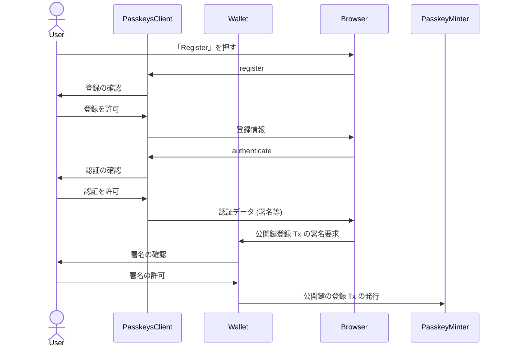
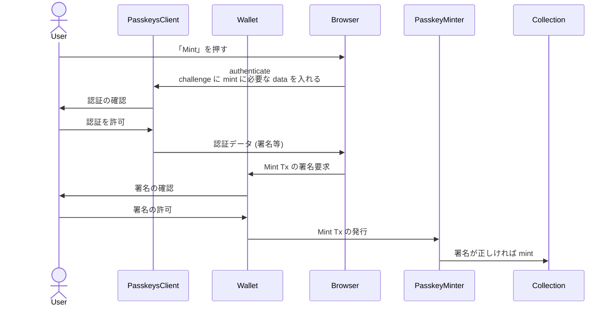

こんにちは。[SIVIRA Inc.](https://sivira.co/index-ja.html) で unWallet の開発をしている taxio です。

今年の3/20、Polygon Mainnet に [RIP-7212](https://github.com/ethereum/RIPs/blob/ef0bb21cf754386cf0f0d6e578f35ef58ebb72a6/RIPS/rip-7212.md) が入りました。[^polygon-release]
[^polygon-release]: https://github.com/maticnetwork/bor/releases/tag/v1.2.7

Passkeys などで使われる secp256r1 が Precompiled Contract として使えるようになったので、今回はそれを用いたコントラクト制御の例をご紹介します。

## RIP-7212
RIP-7212 では新たに `P256VERIFY` という、secp256r1 の楕円曲線を用いた署名の検証をする Precompiled Contract が追加されました。

Precompiled Contract とは opcode のように EVM 自体に実装されている命令セットのようなものです。[^precompiled-contract]
`ecRecover` なんかはよく使われていますね。
[^precompiled-contract]: https://www.evm.codes/precompiled

楕円曲線暗号で利用する楕円曲線のパラメータは推奨値があり、追加された secp256r1 はその１つです。
Bitcoin や Ethereum 系では secp256k1 が主に使われています。

secp256r1 は様々なプロダクトの署名機構に採用されており、Proposal では以下の4つが例示されています。

* Apple's Secure Enclave
* Webauthn
* Android Keystore
* Passkeys

RIP-7212 ではこれらの署名検証機構を Precompiled Contract に入れることで、off-chain 側との連携性を高め、セキュリティと鍵管理の利便性を向上させることを目的としています。

今回は例示されている Passkeys を用いてコントラクトを制御してみます。

## Passkeys でコントラクト制御をやってみる
### `P256VERIFY` の使い方
`P256VERIFY` は address `0x100` で定義されました。
引数は以下の5つです。

| 引数 | 説明 |
| --- | --- |
| `hash` | 署名対象データのハッシュ値 |
| `r` | 署名の r |
| `s` | 署名の s |
| `x` | 公開鍵の x 座標 |
| `y` | 公開鍵の y 座標 |

Solidity では Precompiled Contract は組み込みの関数として使えるのですが、`P256VERIFY` は実装されていないので、以下のように直接コントラクトを叩きます。

```solidity
bytes memory callData = abi.encodePacked(hash, r, s, x, y);
(bool success, bytes memory data) = address(0x100).staticcall(callData);
bytes32 ret = abi.decode(data, (bytes32));
```

署名の検証に成功している場合は `ret` には `1` が、失敗している場合は `0` が入ります。

### Passkeys の payload の構造
Passkeys では署名 (認証) 時に以下のような payload を構築します。

```
dictionary PublicKeyCredentialRequestOptions {
    required BufferSource                challenge;
    unsigned long                        timeout;
    USVString                            rpId;
    sequence<PublicKeyCredentialDescriptor> allowCredentials = [];
    DOMString                            userVerification = "preferred";
    AuthenticationExtensionsClientInputs extensions;
};
```
ref: https://www.w3.org/TR/webauthn-2/#dictdef-publickeycredentialrequestoptions

この `challenge` には本来、登録するサイトが発行したランダムな情報を入れます。

今回はここにコントラクトの操作に必要な情報を入れて、ユーザの Passkeys クライアントで署名し、その署名データと challenge の内容をコントラクトに送信します。

### Contract 上での署名メッセージの構築
先ほどの `PublicKeyCredentialRequestOptions` は JSON になっているのですが、これをそのまま Contract に渡すと、コントラクト内でのパースが大変です。

欲しいのは `challenge` の内容と署名データのハッシュ値なので、Payload の中身を「`challenge` の前の文字列」「`challenge`」「`challenge`の後の文字列」の3つに分割し、それを渡したうえで、コントラクト内で concat してハッシュ値を再度取得します。

しかし、`isValidSignature` や `validateUserOp` などの既存の検証系メソッドは、大体署名メッセージのハッシュ値と署名データを受け取るようになっているので、この `challenge` 前後の文字列情報を素直に渡すことができません。

幸いいずれのメソッドも `signature` が `bytes` になっているので、ここに必要な情報をどんどん埋め込んでいきます。

```solidity
(
    uint r,
    uint s,
    bytes memory authData,
    string memory clientDataPre,
    string memory clientDataPost
) = abi.decode(signature, (uint, uint, bytes, string, string));
```

`clientDataPre`, `clientDataPost` は `challenge` の前後の文字列情報です。
`authData` は署名したクライアントの情報です。

これらを concat することで大元の署名対象データを構築し直し、`P256VERIFY` に渡して署名を検証します。

## デモ
以上の内容を踏まえ、Passkeys を登録し、それを使って ERC-1155 を mint できるデモサイトを作ってみました。
(色々作り込みが甘いのは目を瞑ってください🙏)

https://passkey-contract-example.vercel.app/

まずは「Register」を押して公開鍵を登録します。
以下のように Passkeys のクライアントが反応するはずです。


その後、Passkeys による認証をして、公開鍵を登録する Tx を発行するために Wallet での署名が求められます。
Wallet での署名は Tx が発行できれば何でもいいので、どの Wallet で行ってもかまいません。

公開鍵登録をした Tx です。
https://polygonscan.com/tx/0x5b941f3cc9bae1281e97cf1c38909bde1a3c6bdc00ca259802f1097decc507d6
使用した Gas Unit は 86,317 でした。

処理としては以下のようになります。



登録完了後に「Sign In」をクリックし、Passkeys で認証すると、登録されている情報が表示されます。
ここでは認証後の credentialId を元に Contract 上の公開鍵情報を引っ張ってきているだけなので Tx は発行しません。


登録した公開鍵情報を使って Mint してみます。
右下の「Receive Address」に NFT を受け取りたいアドレスを入力し、「Mint」をクリックします。


Mint をした Tx です。
https://polygonscan.com/tx/0xa8d8b13b2e9c6eb6444155168cde1b5a27cf260c59d3ee18fc9be00f9e8d4db4
使用した Gas Unit は 98,267 でした。
Mint と署名検証を合わせて 10k gas を越えてないのは、中々現実的ではないでしょうか。

処理としては以下のようになります。



1つの公開鍵で Mint できる NFT は1つまでに制限しています。

以上が、Passkeys を使ったコントラクト制御の例です。
コードは公開しているので、ぜひ参考にしてみてください。

https://github.com/taxio/passkey-contract-example

## 課題点
以下に実際に実装してみて感じた課題点を挙げます。

### Passkeys の UI/UX では署名内容が分からない
現状、Passkeys をサポートするクライアントでは challenge の内容を表示していません。

ユーザは署名対象のデータを確認できないので、どういった操作が実際に行われるのかはサイトをトラストする必要があります。

一応登録しているドメインが一致しないと該当の Passkeys は起動しない様なので、詐欺サイトでいきなりコントラクト操作の署名を求められることは考えにくいでしょう。

### Owner アドレスが無い
当たり前ですがアドレスが無いので、ユーザを管理する方法を考える必要があります。

EOA と同様に公開鍵からアドレスを算出する方法が有効でしょう。

## まとめ
Polygon Mainnet に `P256VERIFY` という Precompiled Contract が追加され、secp256r1 による署名の検証が可能になりました。
ガス代も非常に現実的なので、例えば AA などでも署名機構の選択肢がどんどん増えていきそうですね。
他の chain もどんどん追従していってほしいです。

### 参考文献
https://github.com/maticnetwork/Polygon-Improvement-Proposals/PIPs/PIP-27.md

https://github.com/itsobvioustech/aa-passkeys-wallet

https://github.com/itsobvioustech/aa-passkeys-client

https://github.com/Banana-Wallet/banana-passkey-eoa

https://gist.github.com/ulerdogan/2ff36487fe5e4f5e5a8d5ff299e82fa2
