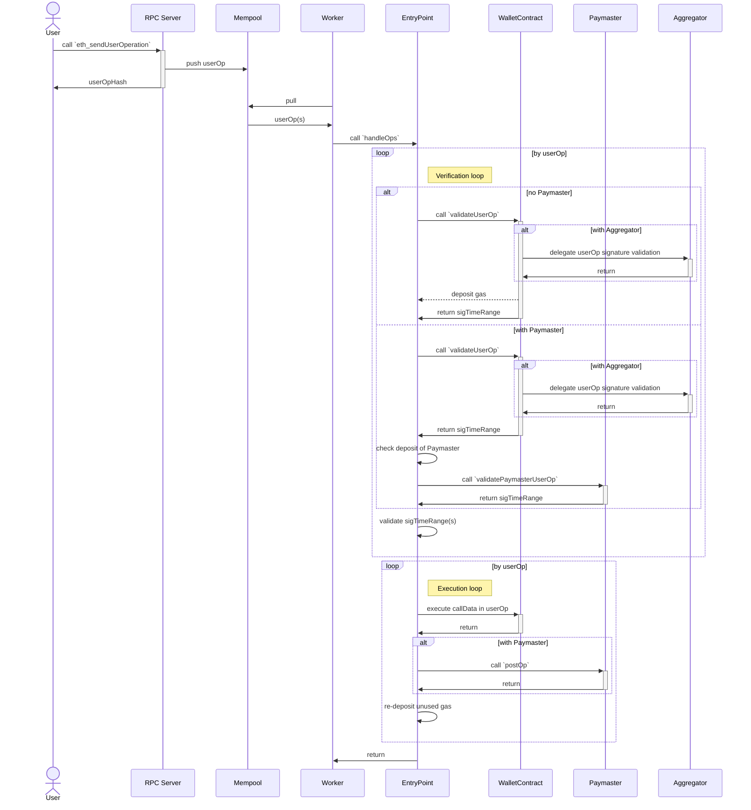
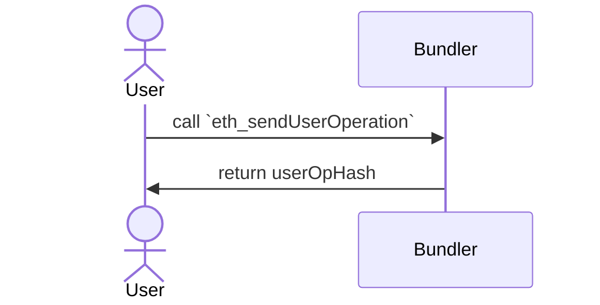

[EIP-4337: Account Abstraction Using Alt Mempool](https://eips.ethereum.org/EIPS/eip-4337) において、User が userOp (UserOperation) を Bundler に投げてから Tx (Transaction) が発行されるまでの間に各コンポーネント間でどのようなやりとりがあるのかをまとめる。

Discraim
* EIP-4337 は現在 (2022/1/15) Draft 状態であり、内容は変わっていく可能性がある。この記事では Commit Hash `5a1ad4072438d9e9f7c934b66464dc05a4b37d02` 時点の内容を元にしている。

## Summary
各コンポーネント間のやりとりをまとめると以下のようになる。

Bundler は JSON-RPC Server, Mempool, Worker の3つのコンポーネントから成る。

ここからは上記の図をそれぞれ分割しながら解説していく。

## User から見た userOp と Tx
User は Bundler に対して Tx を発行するための userOp を投げる。
Bundler は JSON-RPC Server として API を公開しているため、`eth_sendUserOperation` RPC がこの操作に該当する。
userOp は Bundler 内部で非同期に処理されるため、この時 User は userOp のハッシュ値を受け取るだけになる。
User は userOp の処理結果を知るために `eth_getUserOperationReceipt` RPC を Call する必要があり、このリクエスト時に `userOpHash` を利用する。

## Bundler が userOp から Tx を発行するまで
`eth_sendUserOperation` で受けとった userOp は Mempool へ保存される。
一定間隔で Mempool から userOp を複数取り出し、まとめて EntryPoint へ投げる。

### userOp を Bundle して EntryPoint へ

### Verification loop

### Execution loop

## まとめ
* 各コンポーネント間でどのようなやりとりがあるのかを紹介した。
* 図に示した処理の合間にもいくつか重要な処理が存在するが今回は省いている。また別の記事で紹介する。
