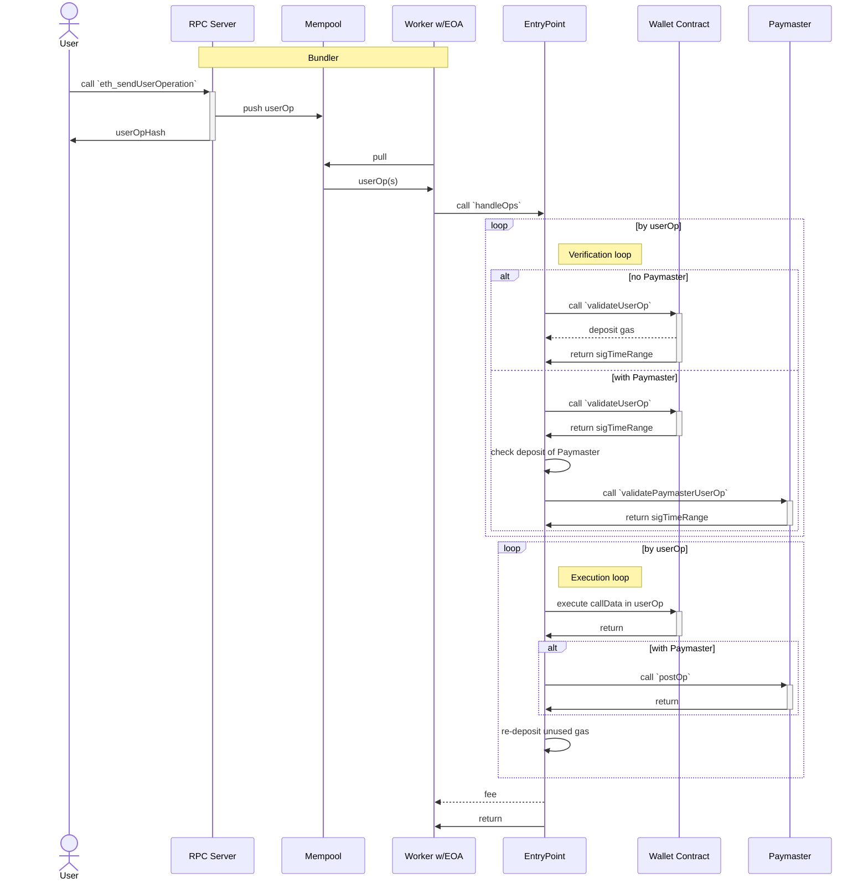
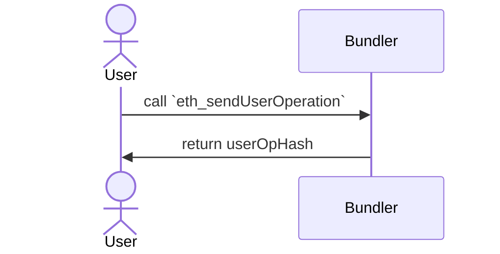
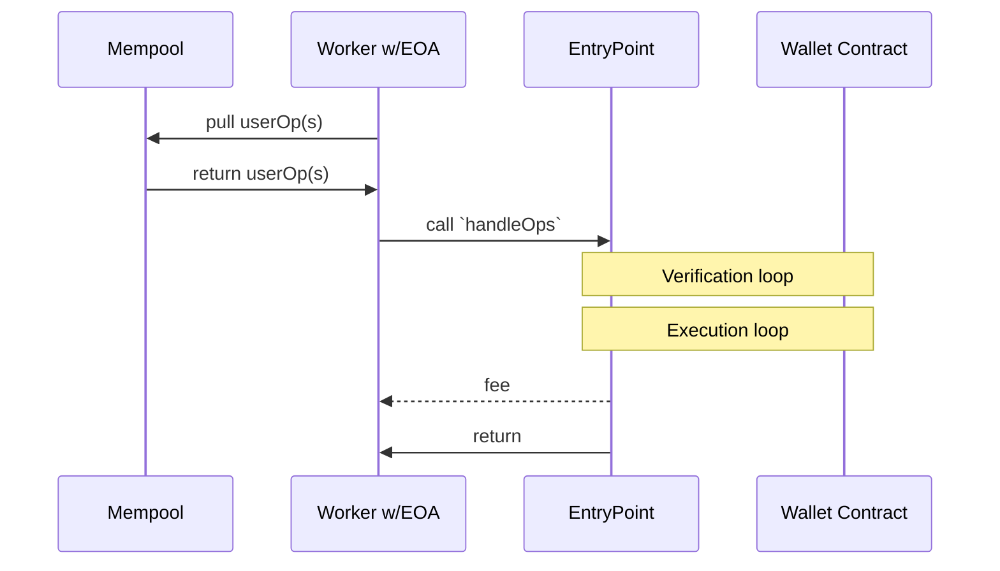
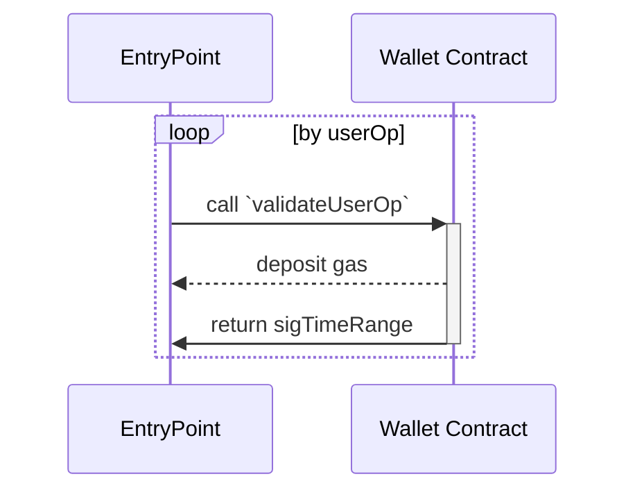
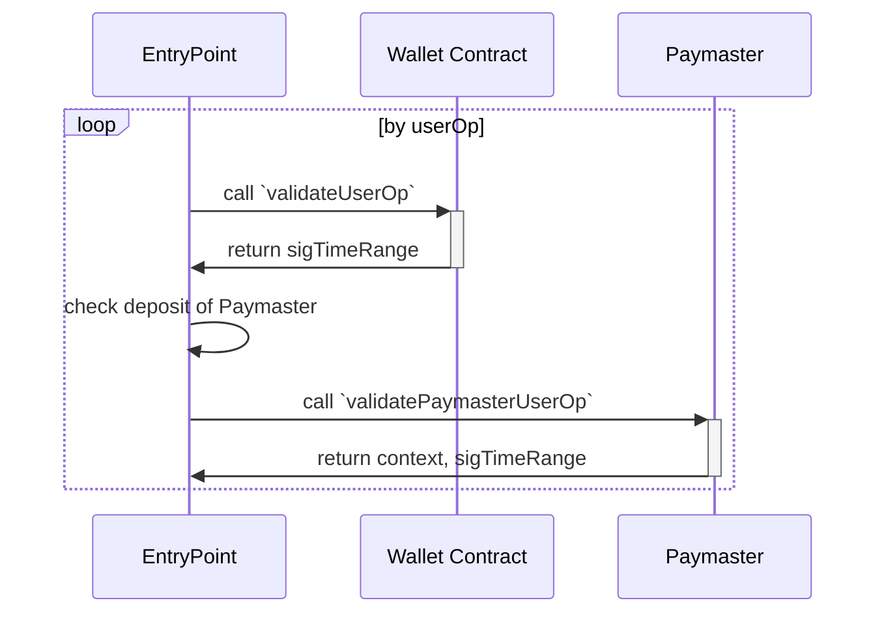
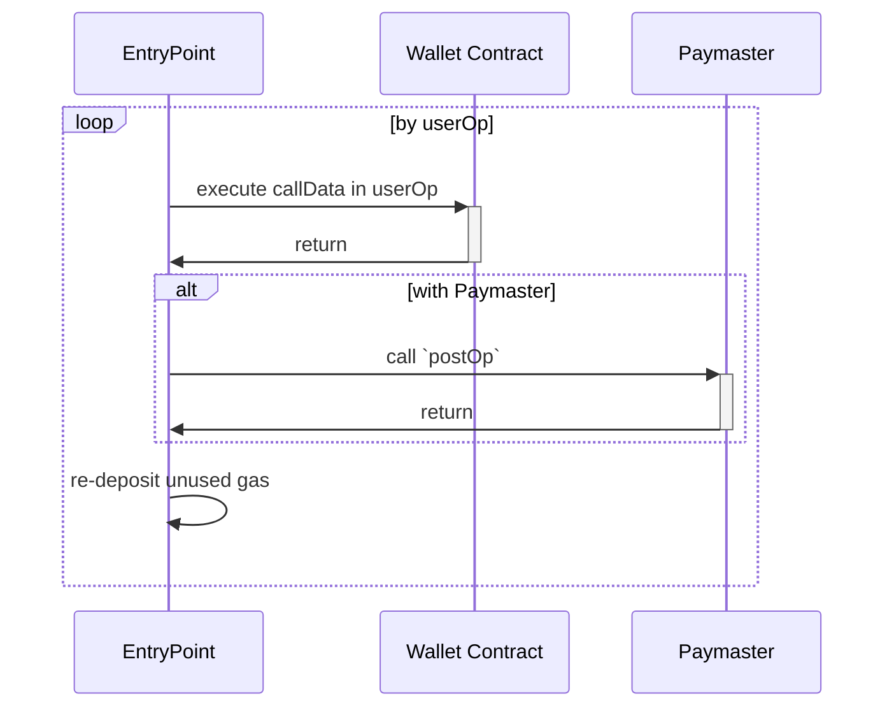

[EIP-4337: Account Abstraction Using Alt Mempool](https://eips.ethereum.org/EIPS/eip-4337) において、User が userOp (UserOperation) を Bundler に投げてから Tx (Transaction) が発行されるまでの間に各コンポーネント間でどのようなやりとりがあるのかをまとめる。

:::message
* EIP-4337 は現在 (2022/1/19) Draft 状態であり、内容は変わっていく可能性がある
* Author チームが参考実装を公開しているので、今回は以下の時点での実装を参考にしている
  * https://github.com/eth-infinitism/account-abstraction/tree/8f5d060a8ef9c649df3dcf8a84cc47c8964279ab 
  * https://github.com/eth-infinitism/bundler/tree/828190fe263d880a04c0edaf19a3790504266c3b
:::

## TL;DR
各コンポーネント間のやりとりをざっくりまとめると以下のようになる。



Bundler は JSON-RPC Server, Mempool, Worker の3つのコンポーネントから成る。
(EIP や参考実装には Worker は出てこないが動作を理解しようとするとこう分けるのが理解しやすい。)

ここからは上記の図をそれぞれ分割しながら紹介していく。

## User から見た userOp と Tx
User は Bundler に対して Tx を発行するための userOp を投げる。



Bundler は JSON-RPC Server として API を公開しているため、`eth_sendUserOperation` RPC がこの操作に該当する。
userOp は Bundler 内部で非同期に処理され、User は userOp のハッシュ値を受け取るだけになる。
User は userOp の処理結果を知るために `eth_getUserOperationReceipt` RPC を Call する必要があり、このリクエスト時に `userOpHash` を利用する。

## Bundler が userOp から Tx を発行するまで
### userOp を Bundle して EntryPoint へ
`eth_sendUserOperation` で受けとった userOp は Mempool へ保存される。
Worker が Mempool から userOp を取り出し、まとめて EntryPoint の `handleOps` へ投げて Tx を発行する。

```solidity:IEntryPoint.sol
function handleOps(UserOperation[] calldata ops, address payable beneficiary) external;
```



EntryPoint から先はコントラクトであるから、`handleOps` を呼び出すタイミングで Tx が開始される。そのため Bundler は EOA を持っており、内部の秘密鍵で署名を行っている。

EntryPoint は渡された userOp をそれぞれ検証・実行する2つのループを順番に実行する。

その後 `beneficiary` が示すアドレスに fee を送金する。Tx 発行のガス代を肩代わりしている Bundler の EOA に向けられるのが一般的であろうが、他のアドレスも指定可能。
fee は userOp の `maxFeePerGas` と `maxPriorityFeePerGas` を用いて [EIP-1559](https://eips.ethereum.org/EIPS/eip-1559) と同様に計算される。もし Bundler が userOp よりも低い設定値で Tx を通すことができれば、その差額が Bundler 側の利益となる。
そのため Bundler 側はこの fee による利益が高くなるように userOp を選択して Bundle する可能性があるだろう。

### Verification loop
それぞれの userOp を検証するループ。



EntryPoint は Wallet Contract の `validateUserOp` を呼び出し、userOp の検証をする。

```solidity:IAccount.sol
function validateUserOp(UserOperation calldata userOp, bytes32 userOpHash, address aggregator, uint256 missingAccountFunds) external returns (uint256 sigTimeRange);
```

この時 Wallet Contract はガス代を EntryPoint に対して支払う。

EntryPoint は内部で Wallet Contract 毎にいくら Deposit されているかを把握しており、それに応じて足りないガス代を `missingAccountFunds` に指定する。
Contract Wallet はこの金額を EntryPoint に Deposit する。

返り値の `sigTimeRange` には検証結果が入っている。

:::details sigTimeRange の中身
uint256 型で先頭からそれぞれ以下のように割り振られている。

>```solidity:IAccount.sol
>/*
>* ...
>* @return sigTimeRange signature and time-range of this operation
>*      <byte> sigFailure - (1) to mark signature failure, 0 for valid signature.
>*      <8-byte> validUntil - last timestamp this operation is valid. 0 for "indefinite"
>*      <8-byte> validAfter - first timestamp this operation is valid
>*      The an account doesn't use time-range, it is enough to return SIG_VALIDATION_FAILED value (1) for signature failure.
>*      Note that the validation code cannot use block.timestamp (or block.number) directly.
>*/
>```
> https://github.com/eth-infinitism/account-abstraction/blob/8f5d060a8ef9c649df3dcf8a84cc47c8964279ab/contracts/interfaces/IAccount.sol#L25-L30

:::

#### Paymaster
ガス代は Contract Wallet ではなく、Paymaster というコントラクトに支払わせることもできる。



EntryPoint は Contract Wallet の `validateUserOp` (`missingAccountFunds=0`) 後に Paymaster がガス代を支払える額を Deposit していることを確認してから `validatePaymasterUserOp` を呼び出す。

```solidity:IPaymaster.sol
function validatePaymasterUserOp(UserOperation calldata userOp, bytes32 userOpHash, uint256 maxCost) external returns (bytes memory context, uint256 sigTimeRange);
```

Paymaster はその userOp のガス代を支払っても良いかの判断を行う。
Contract Wallet がガス代を支払う場合とは違い、Paymaster は `validatePaymasterUserOp` 実行中に EntryPoint へガス代を Deposit しない。そのため事前に十分な金額を Deposit しておく必要がある。

返り値の `context` は後述する Execution loop で利用される。

### Execution loop
実際に Wallet Contract を操作していくループ。



userOp の `callData` を Wallet Contract に投げ、実際に操作を実行する。

>```solidity:EntryPoint.sol
>(bool success,bytes memory result) = address(mUserOp.sender).call{gas : callGasLimit}(callData);
>```
>https://github.com/eth-infinitism/account-abstraction/blob/8f5d060a8ef9c649df3dcf8a84cc47c8964279ab/contracts/core/EntryPoint.sol#L223

Paymaster を使っており Verification loop 時の `validatePaymasterUserOp` で `context` が返ってきている場合は、Contract Wallet 操作後に Paymaster の `postOp` というメソッドが呼ばれる。

```solidity:IPaymaster.sol
function postOp(PostOpMode mode, bytes calldata context, uint256 actualGasCost) external;
```

便利 Callback のような役割をしているので、例えば EntryPoint の Deposit 額が少なくなってきたときに、ここで資金を追加するなどができそう。

余ったガス代は EntryPoint 内で Deposit され次回に活用される。

最後に fee を `handleOps` で指定されている `beneficiary` が示すアドレスに送金して Tx は完了する。

## まとめ
EIP-4337 にて userOp から Tx を発行するときに各コンポーネント間でどのようなやりとりがあるのかを紹介した。

これは Tx を発行するための大枠の流れであり、図に示した処理の合間にまだいくつも重要な処理が存在している。
(userOpHash の組み立て、Mempool 内の userOp スロットリング、Account Factory など...)

また、EntryPoint は `handleOps` とは別に `handleAggregatedOps` というメソッドでも userOps を処理することができる。
ここでは Aggregator という Contract Wallet の代わりに署名の検証を行ってくれるコントラクトが登場し、さらに認可処理が抽象化されている面白い概念である。
また別の記事で紹介したい。
